Architecture
============

.. toctree::
   :maxdepth: 2

Database Diagrams
-----------------

Overview (v0.19)
^^^^^^^^^^^^^^^^

Database overview. As of version 0.19, Book items are broken out into Work and Edition.

(Standard Django and Wagtail tables omitted for simplicity.)

.. image:: _static/db-v019-overview.png
    :target: _static/db-v019-overview.png
    :alt: overview of database structure for version 0.19

Footnote details (v0.21)
^^^^^^^^^^^^^^^^^^^^^^^^

Version 0.21 adds `djiffy <https://github.com/Princeton-CDH/djiffy/>`_
for importing IIIF Manifests and Canvases, in order to link
digitized versions of lending library cards with database footnotes.

:class:`~mep.footnotes.models.Bibliography` records now have an
optional foreign key to an associated :class:`djiffy.models.Manifest`,
and :class:`~mep.footnotes.models.Footnote` records now have an
optional foreign key to a :class:`djiffy.models.Canvas` that
belongs to that manifest.

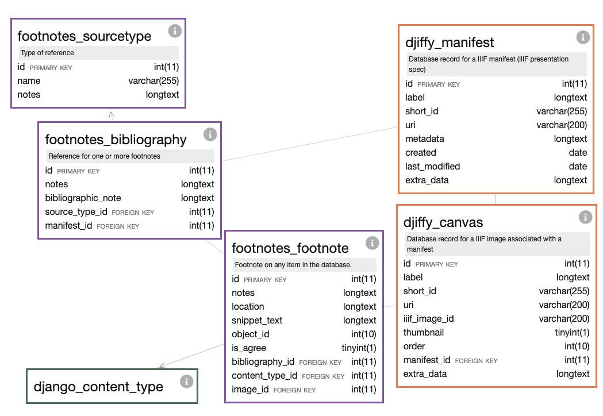

Book details (v0.19)
^^^^^^^^^^^^^^^^^^^^

Work and edition details.

.. image:: _static/db-v019-books.png
    :target: _static/db-v019-books.png
    :alt: work/edition details for version 0.19

Overview (v0.18)
^^^^^^^^^^^^^^^^

Database overview; standard Django and Wagtail tables omitted for simplicity.

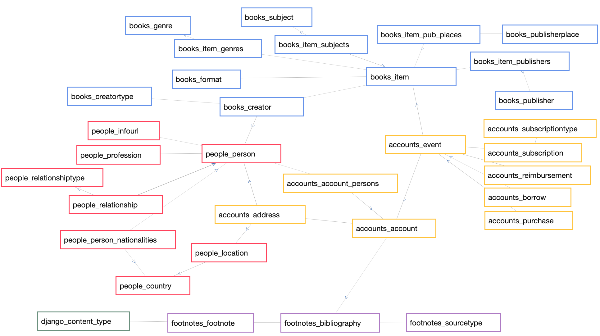

Account Events (v0.18)
^^^^^^^^^^^^^^^^^^^^^^

There are several types of events, related to a common, generic event
(implemented with Django multitable inheritance). As of v0.18, all events
can have an optional associated item and partially known dates, in order
to allow documenting non-standard events from lending library cards.

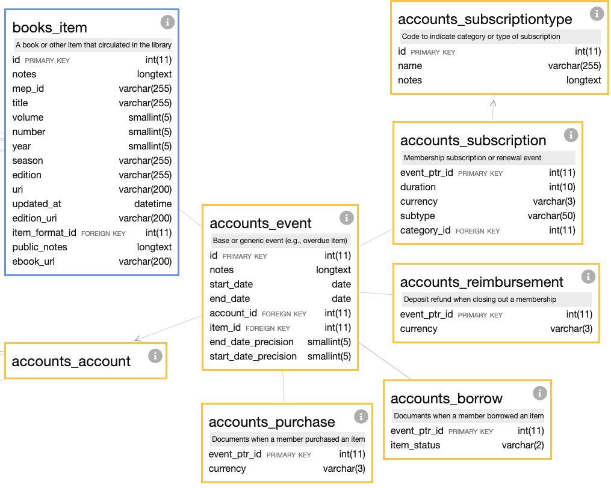

.. Note::
  Diagrams for v0.18 generated with `davila.js <https://github.com/Princeton-CDH/davilajs>`_.

Previous versions
^^^^^^^^^^^^^^^^^

Overview (v0.10) - Wagtail
~~~~~~~~~~~~~~~~~~~~~~~~~~

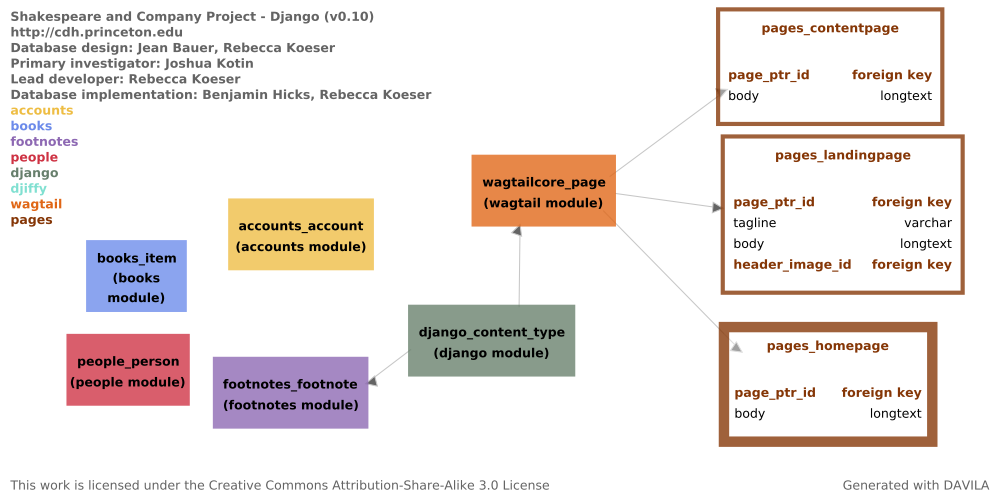

Overview (v0.6)
~~~~~~~~~~~~~~~

.. image:: _static/db-v06-overview.png
    :target: _static/db-v06-overview.png
    :alt: Database Overview v0.6

Person detail (v0.6)
~~~~~~~~~~~~~~~~~~~~

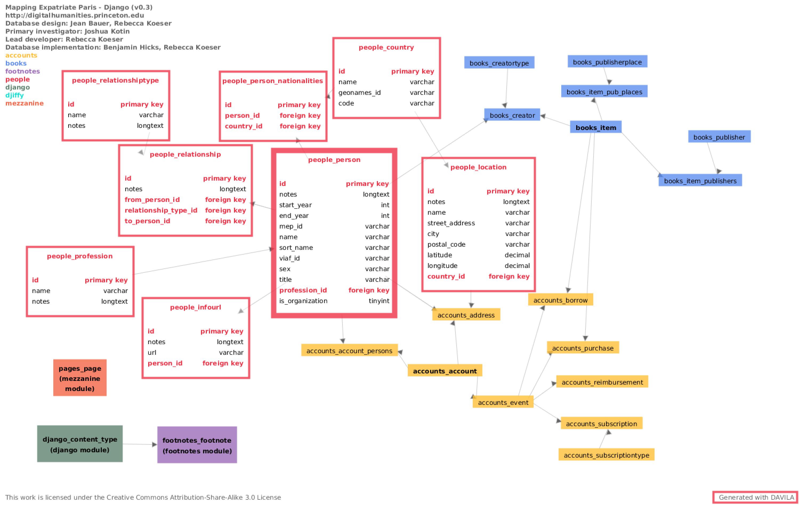

Account detail (v0.6)
~~~~~~~~~~~~~~~~~~~~~

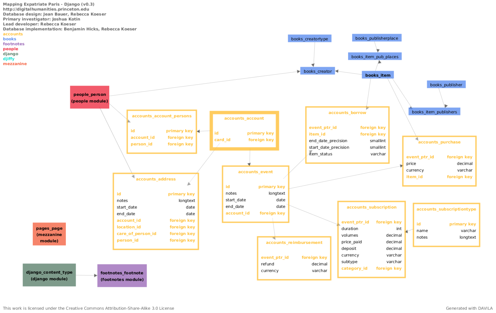

Book detail (v0.6)
~~~~~~~~~~~~~~~~~~

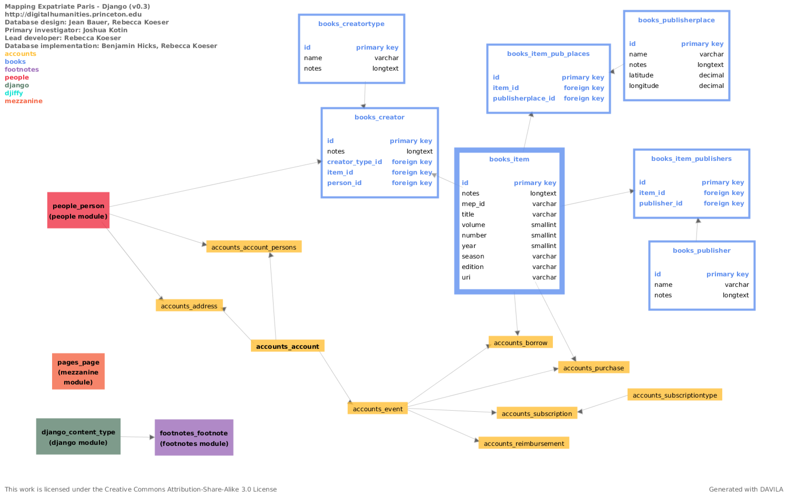

Database Overview (v0.3)
~~~~~~~~~~~~~~~~~~~~~~~~

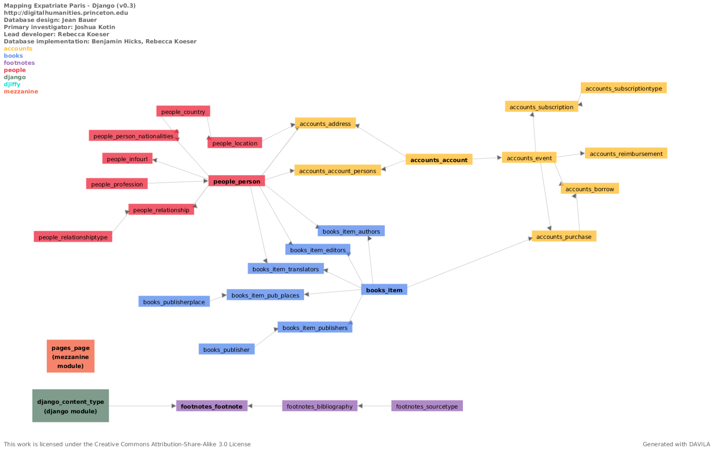

Person detail (v0.3)
~~~~~~~~~~~~~~~~~~~~

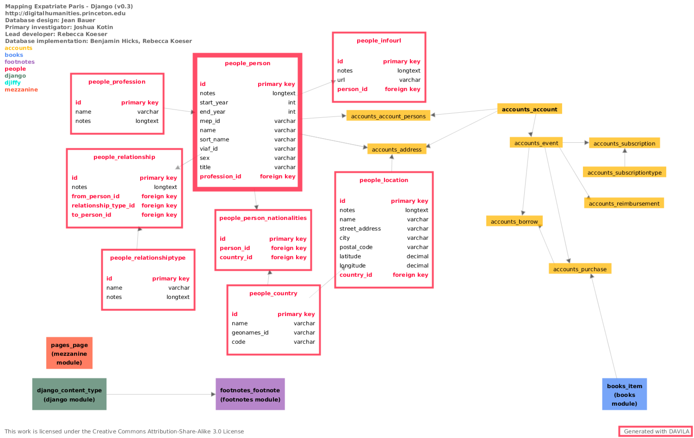

Account detail (v0.3)
~~~~~~~~~~~~~~~~~~~~~

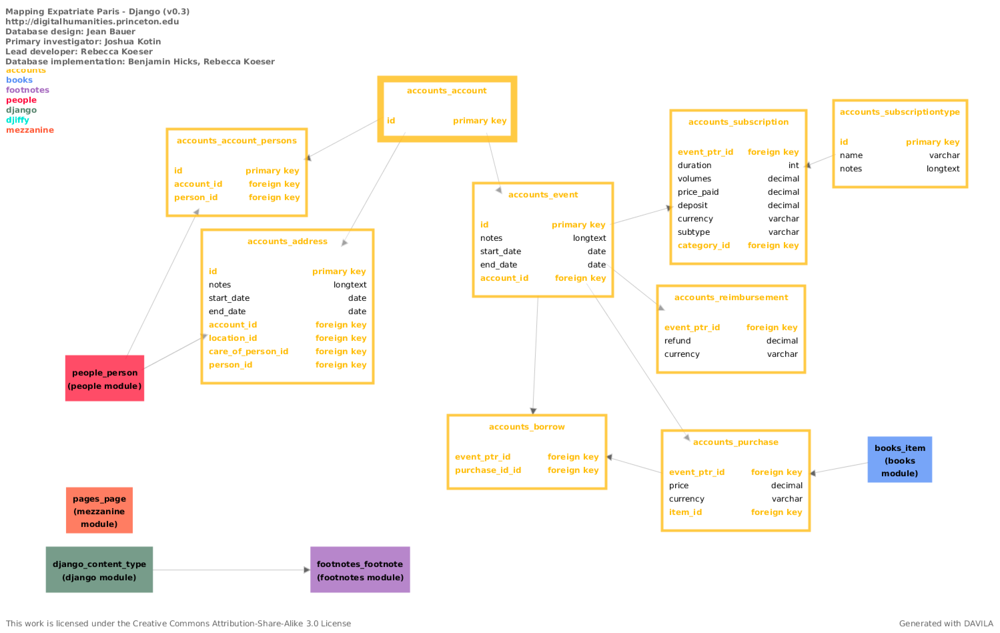

Book detail (v0.3)
~~~~~~~~~~~~~~~~~~

.. image:: _static/db-books-v03.png
    :target: _static/db-books-v03.png
    :alt: MEP Schema - Book detail v0.3

People Detail (0004)
~~~~~~~~~~~~~~~~~~~~
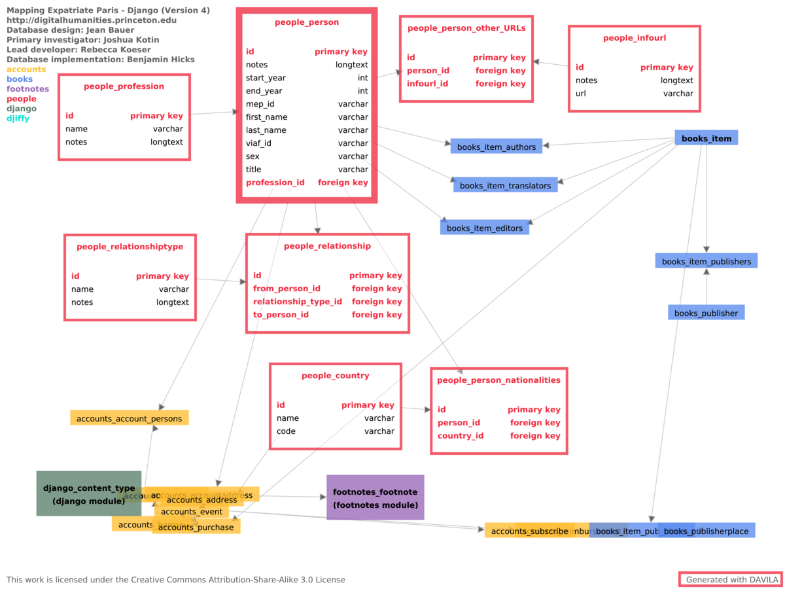

.. NOTE::
    :class:`~mep.people.models.InfoURL` now includes a required ``name`` field

Books Detail (0004)
~~~~~~~~~~~~~~~~~~~
.. image:: _static/books-module-004.png
    :target: _static/books-module-004.png
    :alt: Books Module Detail

Account Detail (0004)
~~~~~~~~~~~~~~~~~~~~~
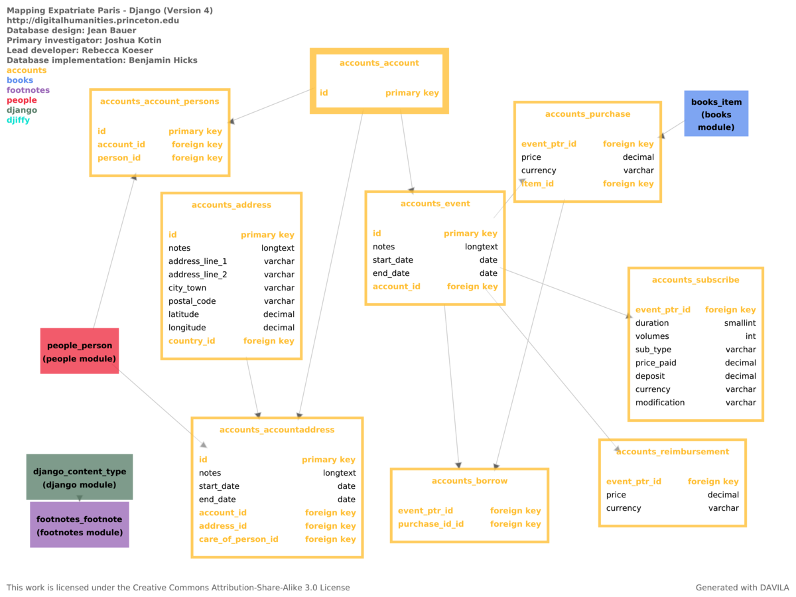

.. NOTE::
    Database diagrams (prior to v0.18) generated with
    `DAVILA <https://github.com/jabauer/DAVILA>`_.
    The ``sphinx-docs`` directory includes a ``customize.csv`` and MySQL dump
    that was used to generate the schema diagrams.

Initial Schema Design (Version 004)
^^^^^^^^^^^^^^^^^^^^^^^^^^^^^^^^^^^

.. image:: _static/mep-schema-004.png
    :target: _static/mep-schema-004.png
    :alt: MEP Schema Design 004

.. NOTE::
    This does not include additional complexity of URLs for people records
    per 19 June 2017 project meeting.

Database updates and changes by version
^^^^^^^^^^^^^^^^^^^^^^^^^^^^^^^^^^^^^^^

0.19
~~~~

- Renamed ``Item`` to :class:`~mep.books.models.Work` and split out
  edition-specific information into :class:`~mep.books.models.Edition`.

0.18
~~~~
- Partial date support has been shifted from :class:`~mep.accounts.models.Purchase` and
  :class:`~mep.accounts.models.Borrow` to :class:`~mep.accounts.models.Event`
  so that any event now supports partial dates.

0.11
~~~~

- Refactor `item` from :class:`~mep.accounts.models.Purchase` and
  :class:`~mep.accounts.models.Borrow` to :class:`~mep.accounts.models.Event`.

0.10
~~~~

- Remove Mezzanine and add Wagtail dependencies.
- Add ``Pages`` module with CMS functionality.

0.9
~~~
- :class:`~mep.accounts.models.Purchase` now has fields and flags for partial start and end dates.
- :class:`~mep.accounts.models.PartialDateMixin` now contains fields and validation for partial dates, including date precision flags.

0.6
~~~

- :class:`~mep.people.models.Person` has a new boolean flag to indicate if the entity is an organization
- :class:`~mep.books.models.Item` creators have been generalized to use a generic
  :class:`~mep.books.models.Creator` and :class:`~mep.books.models.CreatorType`
  rather than limited, specific relationships (Author, Editor, Translator).
- :class:`~mep.accounts.models.Account` now has a relationship to a
  footnote :class:`~mep.footnotes.models.Bibliography` to
  document an associated lending card, if there is one
- :class:`~mep.accounts.models.Borrow` event has date precision flags to track
  partially known dates for both start and end date, a status field to indicate
  if the item was returned,  bought, or missing, and a relationship to
  :class:`~mep.books.models.Item` for the book borrowed.
- The :class:`~mep.accounts.models.Purchase` event is still present in the
  database but not currently in use.

0.3
~~~

- **Address** has been renamed to **Location**, and changed to allow **Person**
  and **Account** to have one or more **Address**, which is a Location
  with optional start/end dates.
- **Subscribe** event has been renamed to **Subscription**; subscription type
  field has been converted from a Django choice field to the
  editable **SubscriptionType**.
- Subscription **duration** has been converted from months and fraction of months
  to the actual days between start and end dates.

0.2
~~~

The overall architectures of the schema remains the same, but several fields were
made less restrictive to accommodate variation in the Logbook data. These include:

- Reimbursement price (now optional)
- Subscribe duration
- Options were provided for Subscribe sub_type fields, as well as for modification.