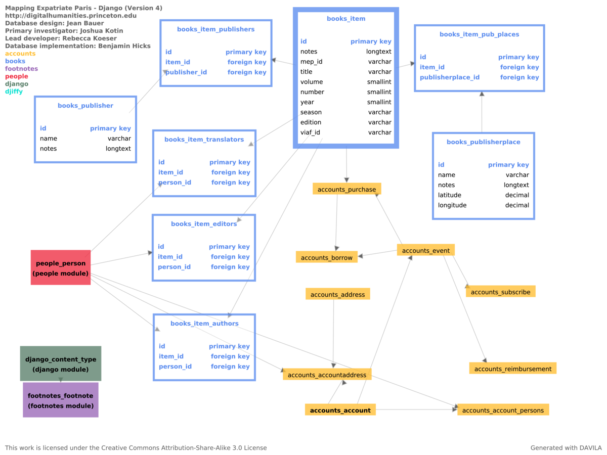

Architecture
============

.. toctree::
   :maxdepth: 2

Database
--------

Updates and Changes
~~~~~~~~~~~~~~~~~~~

0.11 Updates
^^^^^^^^^^^^

- Refactor `item` from :class:`~mep.accounts.models.Purchase` and
  :class:`~mep.accounts.models.Borrow` to :class:`~mep.accounts.models.Event`.

0.10 Updates
^^^^^^^^^^^^

- Remove Mezzanine and add Wagtail dependencies.
- Add ``Pages`` module with CMS functionality.

0.9 Updates
^^^^^^^^^^^
- :class:`~mep.accounts.models.Purchase` now has fields and flags for partial start and end dates.
- :class:`~mep.accounts.models.PartialDateMixin` now contains fields and validation for partial dates, including date precision flags.

0.6 Updates
^^^^^^^^^^^

- :class:`~mep.people.models.Person` has a new boolean flag to indicate if the entity is an organization
- :class:`~mep.books.models.Item` creators have been generalized to use a generic
  :class:`~mep.books.models.Creator` and :class:`~mep.books.models.CreatorType`
  rather than limited, specific relationships (Author, Editor, Translator).
- :class:`~mep.accounts.models.Account` now has a relationship to a
  footnote :class:`~mep.footnotes.models.Bibliography` to
  document an associated lending card, if there is one
- :class:`~mep.accounts.models.Borrow` event has date precision flags to track
  partially known dates for both start and end date, a status field to indicate
  if the item was returned,  bought, or missing, and a relationship to
  :class:`~mep.books.models.Item` for the book borrowed.
- The :class:`~mep.accounts.models.Purchase` event is still present in the
  database but not currently in use.

0.3 Updates
^^^^^^^^^^^

- **Address** has been renamed to **Location**, and changed to allow **Person**
  and **Account** to have one or more **Address**, which is a Location
  with optional start/end dates.
- **Subscribe** event has been renamed to **Subscription**; subscription type
  field has been converted from a Django choice field to the
  editable **SubscriptionType**.
- Subscription **duration** has been converted from months and fraction of months
  to the actual days between start and end dates.

0.2 Updates
^^^^^^^^^^^

The overall architectures of the schema remains the same, but several fields were
made less restrictive to accommodate variation in the Logbook data. These include:

- Reimbursement price (now optional)
- Subscribe duration
- Options were provided for Subscribe sub_type fields, as well as for modification.

Database Diagrams
~~~~~~~~~~~~~~~~~

.. NOTE::
    Detail charts are generated with `DAVILA <https://github.com/jabauer/DAVILA>`_.
    The ``sphinx-docs`` directory includes a ``customize.csv`` and MySQL dump
    that was used to generate the following schema diagrams.

Database Overview (v0.10) - Wagtail
^^^^^^^^^^^^^^^^^^^^^^^^^^^^^^^^^^^

.. image:: _static/db-v010-wagtail.png
    :target: _static/dv-v010-wagtail.png
    :alt: Database Overview (v0.10) - Wagtail

Database Overview (v0.6)
^^^^^^^^^^^^^^^^^^^^^^^^

.. image:: _static/db-v06-overview.png
    :target: _static/db-v06-overview.png
    :alt: Database Overview v0.6

Person detail (v0.6)
^^^^^^^^^^^^^^^^^^^^

Account detail (v0.6)
^^^^^^^^^^^^^^^^^^^^^

Book detail (v0.6)
^^^^^^^^^^^^^^^^^^^^^

Previous versions
~~~~~~~~~~~~~~~~~

Database Overview (v0.3)
^^^^^^^^^^^^^^^^^^^^^^^^

Person detail (v0.3)
^^^^^^^^^^^^^^^^^^^^

.. image:: _static/db-people-v03.png
    :target: _static/db-people-v03.png
    :alt: MEP Schema - Person detail v0.3

Account detail (v0.3)
^^^^^^^^^^^^^^^^^^^^^

.. image:: _static/db-accounts-v03.png
    :target: _static/db-accounts-v03.png
    :alt: MEP Schema - Account detail v0.3

Book detail (v0.3)
^^^^^^^^^^^^^^^^^^^^^

.. image:: _static/db-books-v03.png
    :target: _static/db-books-v03.png
    :alt: MEP Schema - Book detail v0.3

People Detail (0004)
^^^^^^^^^^^^^^^^^^^^
.. image:: _static/people-module-004.png
    :target: _static/people-module-004.png
    :alt: People Module Detail

.. NOTE::
    :class:`~mep.people.models.InfoURL` now includes a required ``name`` field

Books Detail (0004)
^^^^^^^^^^^^^^^^^^^^

Account Detail (0004)
^^^^^^^^^^^^^^^^^^^^^

Initial Schema Design (Version 004)
^^^^^^^^^^^^^^^^^^^^^^^^^^^^^^^^^^^
.. image:: _static/mep-schema-004.png
    :target: _static/mep-schema-004.png
    :alt: MEP Schema Design 004

.. NOTE::
    This does not include additional complexity of URLs for people records
    per 19 June 2017 project meeting.
